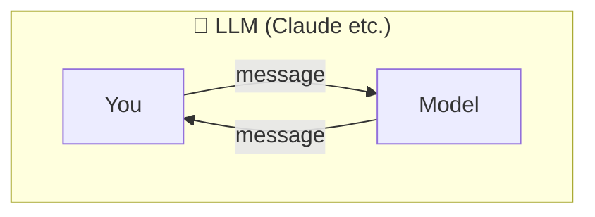
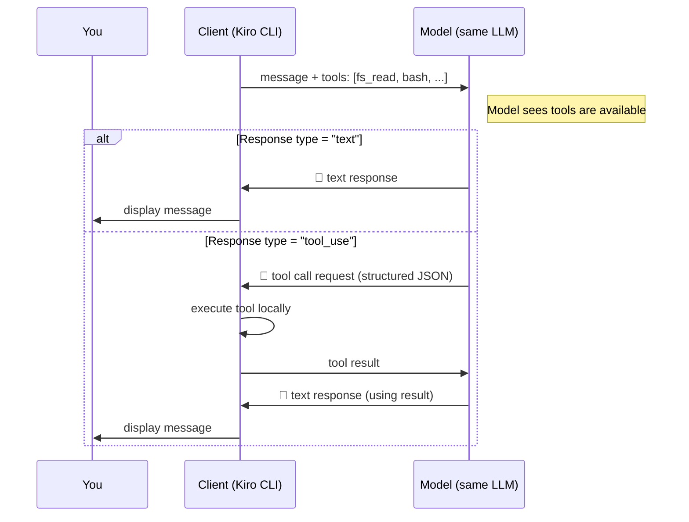

# LLM vs. Agentic AI

- Text in, text out — that's it
- Cannot take actions in the real world
- Cannot read your files, run commands, or call APIs

- Same model, but the client declares available tools in the API request
- Model responds with either **text** or a **tool call request** — the client decides what to do
- No tools declared = text only (basic LLM). Tools declared = agentic.

**Key difference**: LLM = can only talk. Agentic = can talk AND act.
