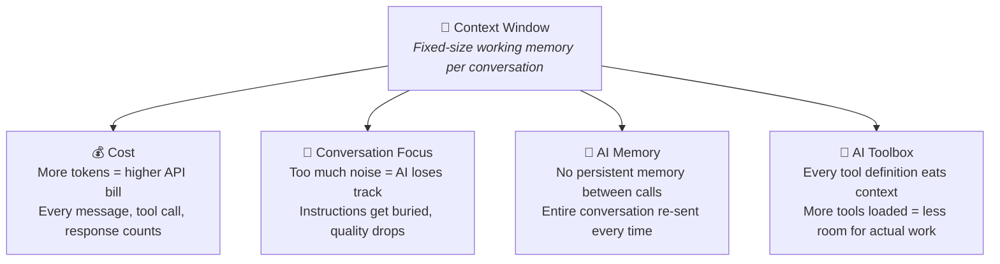
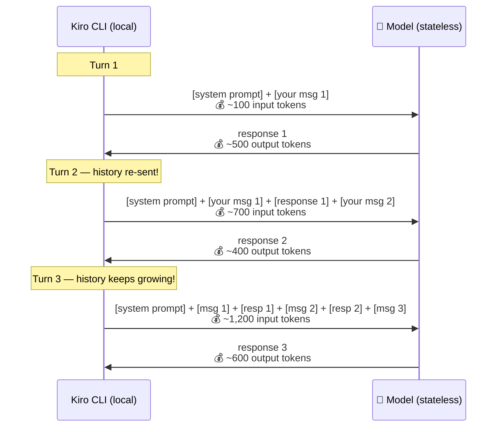

# Why Context Size Matters



- **Cost** — you pay per token, input and output. Bloated context = wasted money on every request
- **Conversation Focus** — the more stuff in context, the worse AI follows instructions ("needle in a haystack")
- **AI Memory** — there is no memory; the full conversation is re-sent with every message. It grows fast.
- **AI Toolbox** — every MCP server, every skill loaded takes space away from your actual task



⚠️ The model is stateless — full conversation is re-sent every turn. Input cost snowballs, output stays proportional to each response.

```
Every turn you send:
├── System prompt (fixed)
│   ├── Base instructions
│   ├── Skill frontmatters (Level 1, all skills)
│   └── MCP tool definitions (all connected servers)
│
├── Conversation history (grows!)
│   ├── Your messages
│   ├── Claude's responses
│   ├── Tool calls + results (MCP responses, file reads, etc.)
│   └── Skill Level 2/3 content (when loaded)
```
