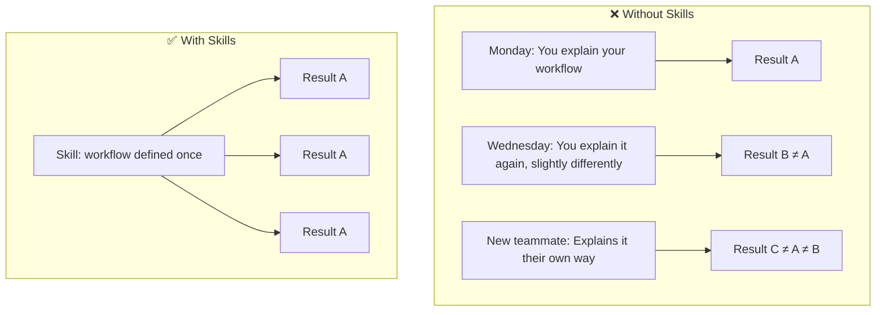
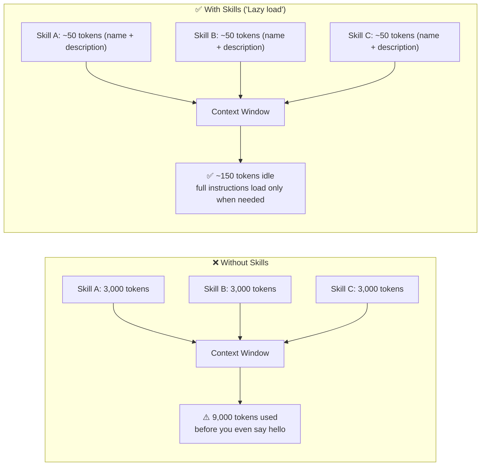

# What Problem Do Skills Solve?

## 1. Reusability & Output Consistency

- Without skills: every person, every session prompts differently → inconsistent results
- With skills: workflow defined once → same quality, same structure, every time, for everyone

## 2. Context Management

- Only a tiny summary is always loaded — the AI knows skills exist, but doesn't load details until needed
- 20 skills naively: ~60,000 tokens. With progressive disclosure: ~2,000 tokens.
