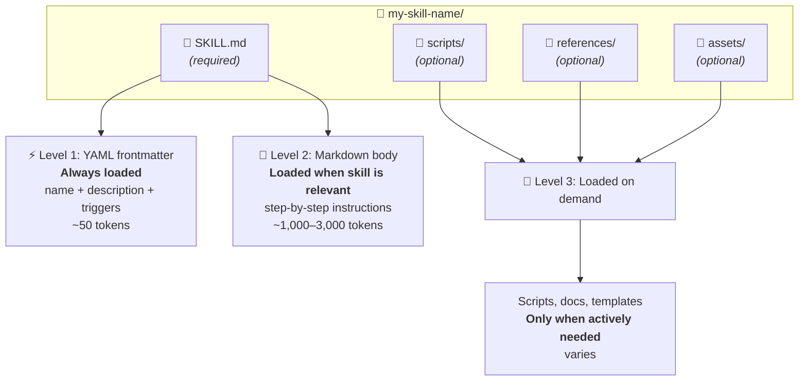
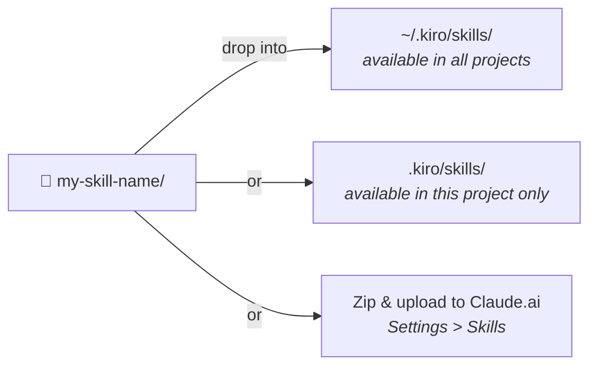

# Anatomy of a Skill



## SKILL.md Structure

```yaml
---
name: my-skill-name          # kebab-case, must match folder name
description: >
  What it does. Use when user asks
  to "do X" or mentions "Y".     # WHAT + WHEN (trigger phrases)
---

# My Skill Name

## Step 1: ...
(detailed instructions in Markdown)
```

## Sharing a Skill



- A skill is just a folder — share it via Git, zip, copy/paste
- Team-wide: drop into a shared repo, everyone clones to `~/.kiro/skills/`
