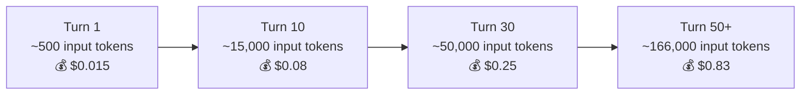
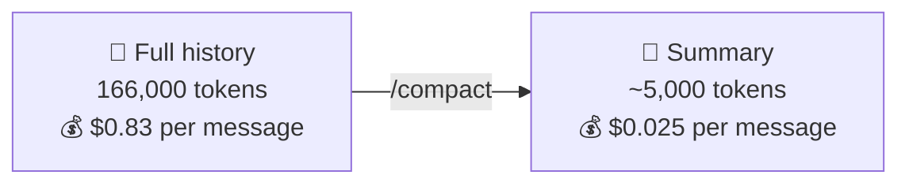

# Real Cost of Context — And How to Manage It

## 1. Price Per Token (Claude Opus, March 2026)

| | Per 1M tokens | Per 1K tokens |
|---|---|---|
| **Input** (what you send) | $5.00 | $0.005 |
| **Output** (what model generates) | $25.00 | $0.025 |



⚠️ Even a one-word "Thanks" at turn 50 costs ~$0.83 — because the entire history is re-sent.

## 2. How to Estimate Your Context Size

```
1. Save your chat history to a file
2. Count the words:  wc -w my-chat.txt
3. Rough conversion:  words ÷ 0.75 ≈ tokens
```

| Words in chat | ≈ Tokens | ≈ Input cost per message (Opus) |
|---|---|---|
| 10,000 | ~13,000 | $0.07 |
| 50,000 | ~67,000 | $0.34 |
| 125,000 | ~166,000 | $0.83 |

Note: this covers conversation only — system prompt + tool definitions add ~4% on top.

## 3. The Fix: `/compact`



- `/compact` summarizes the conversation into a short distilled version
- Replaces the full history — frees up context space
- Tradeoff: details are lost, only key points preserved
- Use it when context gets large and earlier details are no longer needed
